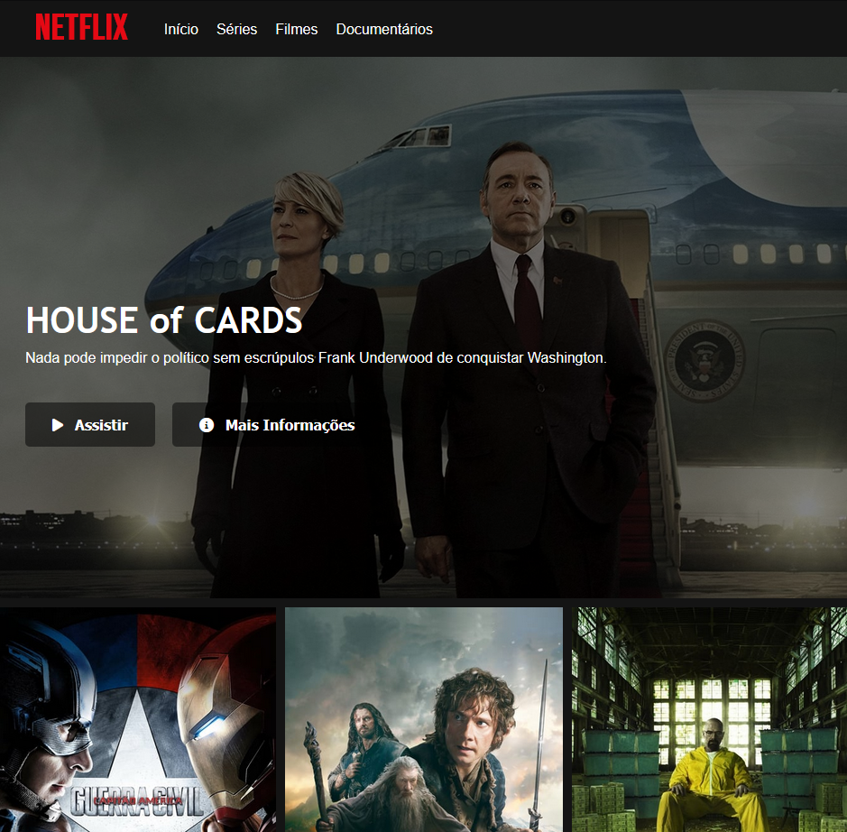

# Projeto-Netflix

Acesse o projeto <a href="https://vomoura.github.io/Projeto-Netflix/">aqui</a>.

## Descrição

Recriação da interface da Netflix para projeto no Bootcamp Carrefour Web Developer.

## Linguagens Utilizadas
  
  HTML

  
 CSS

  
 JavaScript

## Layout 

